# 🛠️ Cybersecurity Project: SOC Automation Lab

This document is the complete project outline for the **SOC Automation Project (Parts 1–5)**.  
It demonstrates building **detection workflows** using an open-source SIEM platform (**Wazuh**), creating **automated playbooks** in a SOAR platform (**Shuffle**), and integrating **TheHive** for security incident case management.

---

## 🔍Project Overview

Build a hands-on cybersecurity lab that demonstrates an end-to-end **Detection → Enrichment → Case Management** workflow:

| Component | Description |
|------------|--------------|
| **Infrastructure** | Windows 10 machine (physical or VM) with internet connectivity, cloud-hosted servers for Wazuh, Shuffle, and TheHive |
| **SIEM/XDR Platform** | Wazuh for security event monitoring and threat detection |
| **SOAR Platform** | Shuffle for security orchestration and automation |
| **Case Management** | TheHive for incident tracking, investigation, and collaborative response |
| **Detection Target** | Simulated threats and security events from Windows endpoint |
| **Automation Workflow** | Event detection → Alert generation → IOC enrichment → Case creation |
| **Learning Outcomes** | SIEM configuration, detection rule creation, SOAR playbook design, case management integration and email notification setup |

---

## 📂Project Parts

1. **Part 1 — Logical Diagram Design** *(draw.io architecture diagram)*  
2. **Part 2 — Infrastructure Setup** *(VM deployment + Wazuh & TheHive installation)*  
3. **Part 3 — Detection Configuration** *(Configuring Wazuh & the TheHive and Agent Deployment)*  
4. **Part 4 — SOAR Integration** *(Generate telemetry to be ingested into Wazuh)*  
5. **Part 5 — Case Management** *(Connect Shuffle, send alert to the TheHive and email to SOC Analyst)*  

---

## Part 1 — Logical Diagram Design

### 📋 Overview

In Part 1, we create a visual blueprint of the SOC automation architecture before building any infrastructure. This logical diagram maps out component relationships, data flows, and integration points.

### 🎯 Objectives

- Design a clear network architecture diagram
- Identify all required components and their purposes
- Map data flow between systems
- Create documentation for implementation phases
- Practice skills commonly tested in technical interviews

---

### 🧰 Tools Required

- **[draw.io](https://app.diagrams.net/)** - Free online diagramming tool

---

### 🏗️ Building the Diagram

#### Step 1: Add Components

1. **Search** for icons: `PC`, `router`, `internet`
2. **Add components:**
   - Windows 10 Client (with Wazuh agent)
   - Router
   - Internet (cloud)
   - 3 cloud instances: Wazuh Manager, TheHive, Shuffle
   - SOC Analyst workstation

#### Step 2: Connect Components

**Create connections** by clicking arrows on icons and dragging to destinations.

**Style connections:**

- Click line → Change to **Link** type
- Apply color coding
- Use **Waypoints** to straighten lines

#### Step 3: Map Data Flow

| Step | Connection | Color | Purpose |
|------|-----------|-------|---------|
| 1 | Windows 10 → Wazuh Manager | Gray | Send events |
| 2 | Wazuh Manager (receive) | Gray | Receive events |
| 3 | Wazuh Manager → Shuffle | Blue | Send alerts |
| 4 | Shuffle → Internet | Green | Enrich IOCs |
| 5 | Shuffle → TheHive | Blue | Create case |
| 6 | Shuffle → Internet | Orange | Send email |
| 7 | Internet → SOC Analyst | Orange | Receive email |

---

### 🔄 Complete Workflow

```yaml
Windows 10 Client → Wazuh Manager (detects threat)
                         ↓
                     Shuffle (orchestrates)
                         ↓
         ┌───────────────┼───────────────┐
         ↓               ↓               ↓
    Enrich IOCs    Create Case    Send Email
    (OSINT)        (TheHive)      (Analyst)

```

---

### 📝 Component Descriptions

#### Windows 10 Client

- Send security events
- Wazuh agent installed

#### Wazuh Manager

- Trigger alerts

#### Shuffle

- Receive alerts
- Enrich IOCs
- Create cases in TheHive
- Send email notifications

#### TheHive

- Case management system

#### SOC Analyst

- Approve/deny containment actions

---

### 🧱 Architectural Diagram

<p align="center">
<br>
<em>📸 Figure-1: Screenshot of Network diagram</em>
</p>

---

## Part 2: Infrastructure Setup

### 📝 Infrastructure Overview

In Part 2, we configure the lab infrastructure by setting up virtual machines and installing required applications. By the end of this part, you will have:

- ✅ Windows 10/11 machine with Sysmon installed
- ✅ Wazuh server running in the cloud
- ✅ TheHive server running in the cloud

### 🎯 Infrastructure Objectives

- Install and configure VirtualBox
- Deploy Windows 10/11 virtual machine
- Install Sysmon with configuration
- Deploy cloud servers for Wazuh and TheHive
- Configure firewall rules
- Verify all services are running

---

### 🖥️ Infrastructure Components

| Component | Platform | Specs | Purpose |
|-----------|----------|-------|---------|
| **Windows 10/11 Client** | VirtualBox or Cloud | 4GB RAM, 6 CPU, 60GB disk | Endpoint with Wazuh agent |
| **Wazuh Server** | Cloud (Vultr/DigitalOcean) | 160GB RAM, 4 CPU | SIEM/XDR platform |
| **TheHive Server** | Cloud (Vultr/DigitalOcean) | 320GB RAM, 6 CPU | Case management system |

---

#### 🔧 Sub-Part 1: VirtualBox and Windows Setup

##### Step 1: Install VirtualBox

###### Download VirtualBox

1. Navigate to **[virtualbox.org](https://www.virtualbox.org)**
2. Click **Download VirtualBox**
3. **Recommended version:** 7.1.12 (Version 7.2 has compatibility issues)
4. Go to **Previous Releases** → Select **7.1.12**
5. Download for your OS (Windows/Mac/Linux)

###### Verify Download (Optional)

```powershell
# Open PowerShell in Downloads folder (Shift + Right-click → Open PowerShell)
Get-FileHash .\VirtualBox-7.1.12-xxxxx.exe
```

Compare hash with SHA256 checksum on VirtualBox website.

###### Install VirtualBox

1. Run installer → Click **Next**
2. Accept license agreement
3. **Warning:** Network will temporarily disconnect during installation
4. Click **Yes** → **Install**
5. Click **Finish**

**Note:** If you encounter a **Microsoft Visual C++ 2019** dependency error, download and install it from Microsoft's website before proceeding.

---

##### Step 2: Download Windows 11 ISO

###### Using Media Creation Tool (Recommended)

1. Search: `Windows 11 ISO`
2. Navigate to **[Microsoft.com](https://www.microsoft.com/software-download/windows11)**
3. Scroll to **Create Windows 11 Installation Media**
4. Click **Download Now**
5. Run the tool → Accept terms
6. Select **ISO file** (not USB)
7. Choose save location (Downloads)
8. Wait ~10-15 minutes for download

###### Alternative: Direct ISO Download

1. On Microsoft page, scroll to **Download Windows 11 Disk Image**
2. Select Windows 11 → Download

---

##### Step 3: Create Windows 11 Virtual Machine

###### Configure VM in VirtualBox

1. Open **VirtualBox** → Click **New**
2. **Configuration:**
   - **Name:** `Windows 11` (or `sjain-PC`)
   - **Folder:** Default
   - **ISO Image:** Browse to Windows 11 ISO in Downloads
   - **Type:** Microsoft Windows
   - **Version:** Windows 11 (64-bit)
   - **Skip Unattended Installation:** ☑️ Check this box

3. **Hardware Settings:**
   - **Base Memory:** 8192 MB (8GB) - *Minimum 4GB*
   - **Processors:** 6 CPUs

4. **Virtual Hard Disk:**
   - **Size:** 60 GB
   - Click **Finish**

###### Start VM and Install Windows

1. Select VM → Click **Start**
2. Press any key when prompted
3. **Installation Steps:**
   - Click **Next** → **Install Now**
   - **Product Key:** Select "I don't have a product key"
   - **Edition:** Windows 11 Pro
   - Accept license terms
   - **Installation Type:** Custom (advanced)
   - Select disk → Click **Next**
4. Wait ~10-15 minutes for installation

---

##### Step 4: Configure Windows 11

###### Initial Setup

1. **Region:** Select your country → **Yes**
2. **Keyboard Layout:** Confirm → **Skip** additional layouts
3. **Device Name:** `sjain-PC` (or custom name) → **Next**
4. **Setup Type:** Set up for personal use

###### Microsoft Account Requirement

**Important:** Windows 11 requires Microsoft account sign-in during setup. You can switch to local account later.

1. Sign in with Microsoft account (or create new one)
2. **Security Info:** Click **Skip for now**
3. **Create PIN:** Enter PIN (optional: include letters/symbols)
4. **Privacy Settings:** Disable unnecessary options → **Accept**
5. **Skip/Decline** remaining prompts (OneDrive, Microsoft 365, etc.)

---

##### Step 5: Install Sysmon

###### What is Sysmon?

**System Monitor (Sysmon)** is a Windows system service that logs detailed system activity to the Windows event log, including:

- Process creation
- Network connections
- File creation time changes
- Registry modifications

###### Download Sysmon

1. Open **Microsoft Edge** in VM
2. Search: `Sysmon`
3. Navigate to **[Sysmon - Sysinternals](https://docs.microsoft.com/sysinternals/downloads/sysmon)**
4. Click **Download Sysmon** → Save to Downloads
5. **If Windows Defender blocks:** Click notification → Keep → Keep anyway
6. Extract ZIP: Right-click → **Extract All**

###### Download Sysmon Configuration

**Use Olaf Hartong's configuration for enhanced logging:**

1. Search: `Sysmon config Olaf`
2. Navigate to **[sysmon-modular GitHub](https://github.com/olafhartong/sysmon-modular)**
3. Scroll to **sysmonconfig.xml** → Click file
4. Click **Raw** button
5. Right-click page → **Save As**
6. Save to **Sysmon folder** in Downloads

---

###### Install Sysmon

**Disable Windows Defender (Temporary):**

```text
Settings → Virus & Threat Protection → Manage Settings → Real-time Protection = OFF
```

**Install via PowerShell:**

1. Navigate to **Sysmon folder** in Downloads
2. **Shift + Right-click** → **Open PowerShell window here**
3. Run as Administrator:

   ```powershell
   # Install Sysmon with configuration
   .\Sysmon64.exe -i sysmonconfig.xml
   ```

4. Click **Agree** in license prompt
5. Wait for "Sysmon64 started" message

---

###### Verify Sysmon Installation

###### Method 1: Services**

```md
```text
Start Menu → Type "services.msc" → Enter  
Locate: Sysmon64  
Status: Running | Startup Type: Automatic  
```

<p align="center">
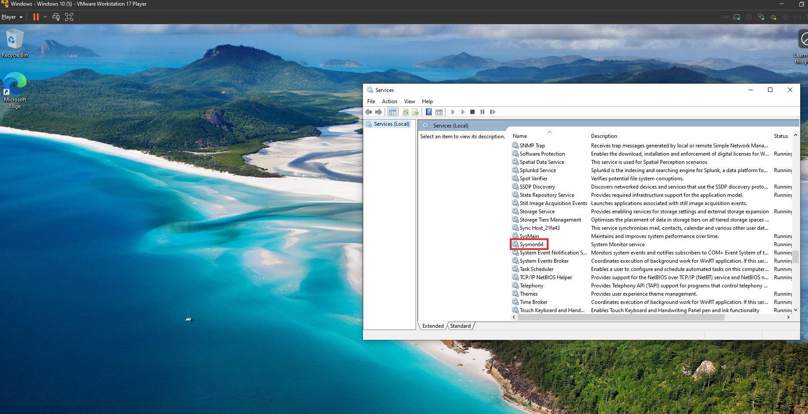<br>
<em>📸 Figure-2: Screenshot of Windows VM with Sysmon installed</em>
</p>

###### Method 2: Event Viewer**

```md
```text
Start Menu → Type "Event Viewer" → Enter
Navigate: Applications and Services Logs → Microsoft → Windows → Sysmon → Operational
Verify: Logs are being generated
```

---

##### Step 6: Create VM Snapshot

**Purpose:** Snapshot allows rollback if configuration issues occur.

1. In VirtualBox, select VM
2. Click **Machine** → **Take Snapshot**
3. **Name:** `Sysmon-Installed`
4. Click **OK**
5. Wait for snapshot completion

---

#### ☁️ Sub-Part 2: Cloud Infrastructure Setup

##### Step 1: Choose Cloud Provider

**Recommended Providers:**

| Provider | Free Credits | Notes |
|----------|--------------|-------|
| **Vultr** | $300 (first-time users) | Recommended for this lab |
| **DigitalOcean** | $200 (60 days) | Alternative option |
| AWS / Azure / GCP | Varies | More complex, not recommended |

**Requirements:**

- Valid credit card (not charged during free credit period)
- Email address for account verification

**Sign up link for Vultr:** *(Instructor will provide referral link in video description)*

---

##### Step 2: Deploy Wazuh Server

###### Create Server Instance

1. Log into **Vultr** dashboard
2. Click **Deploy** → **Deploy New Server**
3. **Server Configuration:**
   - **Server Type:** Cloud Compute - Shared CPU
   - **Location:** Choose closest region (e.g., Toronto, New York)
   - **Operating System:** Ubuntu 24.04 LTS
   - **Plan:** 4 vCPU | 8GB RAM | 160GB SSD ($24/month)
   - **Hostname:** `sjain-Wazuh`
   - **Auto Backups:** Disable
   - **IPv6:** Disable

4. Click **Deploy Now**
5. Wait ~5 minutes for server provisioning

<p align="center">
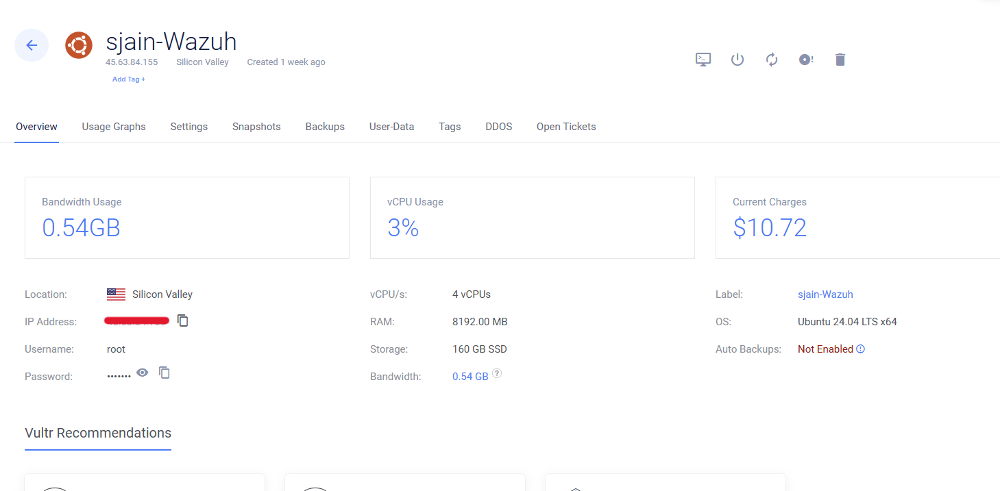<br>
<em>📸 Figure-3: Screenshot of Wazuh Instance</em>
</p>

---

###### Configure Firewall

**Important:** Configure firewall BEFORE installing Wazuh to prevent unauthorized access.

1. Navigate to **Networking** → **Firewall**
2. Click **Add Firewall Group**
3. **Name:** `SOC-Automation-1.0 FW`
4. **Inbound Rules:**

    | Protocol | Port | Source | Purpose |
    |----------|------|--------|---------|
    | TCP | 22 | My IP | SSH access |
    | TCP | 9000 | My IP | Splunk Dashboard Access |

5. **Get Your Public IP:**
   - Search: `what is my IP`
   - Copy your IP address
   - Add to firewall rules

6. **Default Action:** Drop all other traffic
7. Click **Create Firewall Group**
8. **Attach to Server:**
   - Select server → Settings → Firewall
   - Attach `SOC-Automation-1.0 FW`

<p align="center">
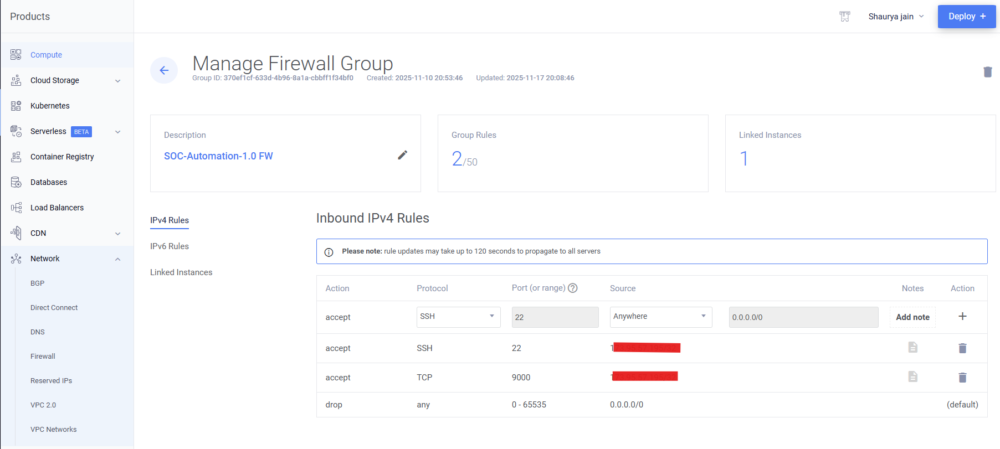<br>
<em>📸 Figure-4: Screenshot of Firewall Configuration</em>
</p>

---

###### Access Wazuh Server

###### Option 1: Vultr Console

1. Go to server → Click **View Console** (monitor icon)

###### Option 2: SSH (Recommended)

```powershell
# From your local machine (PowerShell/Terminal)
ssh root@<WAZUH_SERVER_IP>

# Example:
ssh root@137.220.53.146
    ```
    - **Password:** Copy from Vultr dashboard (server details)
    - First login: Type `yes` to accept fingerprint
    - Paste password (right-click in PowerShell)
    ```
---

#### Update System

```bash
# Update package lists
apt-get update

# Upgrade installed packages
apt-get upgrade -y
```

<p align="center">
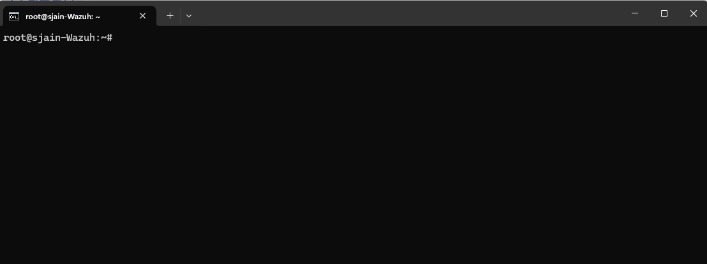<br>
<em>📸 Figure-5: Screenshot of Wazuh Console</em>
</p>

---

###### Install Wazuh

**Automated Installation:**

1. Navigate to **[Wazuh Installation Guide](https://documentation.wazuh.com/current/installation-guide/)**
2. Select **Quick Start** → Copy installation command
3. Run in SSH session:

   ```bash
     curl -sO https://packages.wazuh.com/4.12/wazuh-install.sh && sudo bash ./wazuh-install.sh -a
   ```

4. Wait ~10-15 minutes for installation
5. **Save credentials:**

```json
Username: admin
Password: <generated_password>
```

**Important:** Copy password to notepad - needed for dashboard login.

---

###### Configure Host Firewall

**Enable HTTPS access to Wazuh dashboard:**

```bash
# Allow HTTPS traffic
ufw allow 443/tcp

# Verify rule added
ufw status
```

---

###### Access Wazuh Dashboard

1. Open browser → Navigate to: `https://<WAZUH_SERVER_IP>`
2. **Security Warning:** Click **Advanced** → **Proceed**
3. **Login:**
   - Username: `admin`
   - Password: `<saved_password>`
4. **Success:** Wazuh dashboard loads

<p align="center">
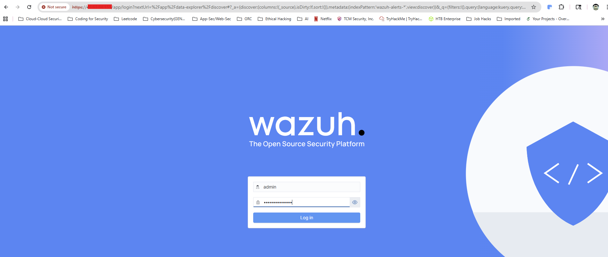<br>
<em>📸 Figure-6: Screenshot of Wazuh Dashboard Login Page</em>
</p>

<p align="center">
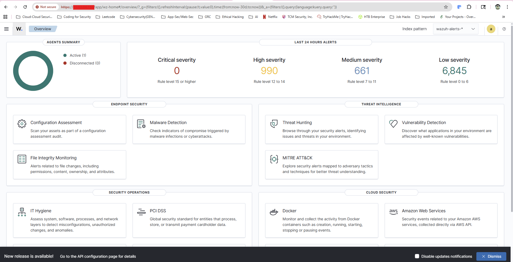<br>
<em>📸 Figure-7: Screenshot of Wazuh Dashboard Landing Page</em>
</p>

---

##### Step 3: Deploy TheHive Server

###### Create TheHive Server Instance

1. Click **Deploy** → **Deploy New Server**
2. **Server Configuration:**
   - **Server Type:** Cloud Compute - Shared CPU
   - **Location:** Same region as Wazuh
   - **Operating System:** Ubuntu 24.04 LTS
   - **Plan:** 6 vCPU | 16GB RAM | 100GB SSD ($48/month)
     - *TheHive requires more resources due to Cassandra and Elasticsearch*
   - **Hostname:** `sjain-TheHive`
   - **Auto Backups:** Disable

3. Click **Deploy Now**

<p align="center">
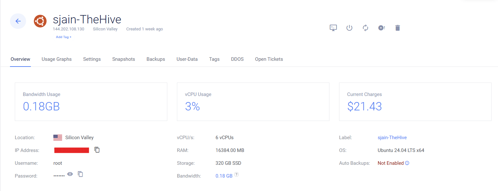<br>
<em>📸 Figure-8: Screenshot of the TheHive Instance</em>
</p>

---

###### Access TheHive Server

```powershell
ssh root@<THEHIVE_SERVER_IP>
```

<p align="center">
<br>
<em>📸 Figure-9: Screenshot of the TheHive Console</em>
</p>

---

###### Update System

```bash
apt-get update
apt-get upgrade -y
```

---

###### Install Dependencies

**Install required packages:**

```bash
apt install wget gnupg apt-transport-https git ca-certificates ca-certificates-java curl software-properties-common python3-pip lsb-release -y
```

---

###### Install Java

**Add Java repository:**

```bash
wget -qO- https://apt.corretto.aws/corretto.key | sudo gpg --dearmor -o /usr/share/keyrings/corretto.gpg
echo "deb [signed-by=/usr/share/keyrings/corretto.gpg] https://apt.corretto.aws stable main" | sudo tee -a /etc/apt/sources.list.d/corretto.sources.list
```

**Install Java 11:**

```bash
apt update
apt install java-common java-11-amazon-corretto-jdk -y
```

**Verify installation:**

```bash
java -version
```

**Expected output:**

```bash
openjdk version "11.x.x"
```

---

###### Install Apache Cassandra

**Add Cassandra repository:**

```bash
wget -qO - https://downloads.apache.org/cassandra/KEYS | sudo gpg --dearmor -o /usr/share/keyrings/cassandra-archive.gpg
echo "deb [signed-by=/usr/share/keyrings/cassandra-archive.gpg] https://debian.cassandra.apache.org 40x main" | sudo tee -a /etc/apt/sources.list.d/cassandra.sources.list
```

**Install Cassandra:**

```bash
apt update
apt install cassandra -y
```

---

###### Install Elasticsearch

**Add Elasticsearch repository:**

```bash
wget -qO - https://artifacts.elastic.co/GPG-KEY-elasticsearch | sudo gpg --dearmor -o /usr/share/keyrings/elasticsearch-keyring.gpg
echo "deb [signed-by=/usr/share/keyrings/elasticsearch-keyring.gpg] https://artifacts.elastic.co/packages/7.x/apt stable main" | sudo tee /etc/apt/sources.list.d/elastic-7.x.list
```

**Install Elasticsearch:**

```bash
apt update
apt install elasticsearch -y
```

---

###### Install TheHive

**Download TheHive package:**

```bash
wget https://archives.strangebee.com/deb/thehive_5.5.7-1_all.deb
```

**Current version as of recording:** 5.5.7

**Install package:**

```bash
dpkg -i thehive_5.5.7-1_all.deb
```

---

### ⚠️ Important Notes

#### TheHive Trial Limitation

**TheHive 5.x has a 14-day trial period.** Plan to complete the entire lab within 14 days after TheHive installation.

---

### ✅ Verification Checklist

Before proceeding to Part 3, verify:

**Windows Client:**

- [ ] Windows 11 VM running in VirtualBox
- [ ] Sysmon installed and generating logs
- [ ] VM snapshot created

**Wazuh Server:**

- [ ] Server deployed and accessible via SSH
- [ ] Firewall configured (port 443 open)
- [ ] Wazuh installation completed
- [ ] Dashboard accessible via browser
- [ ] Admin credentials saved

**TheHive Server:**

- [ ] Server deployed and accessible via SSH
- [ ] Firewall attached
- [ ] Java, Cassandra, Elasticsearch installed
- [ ] TheHive package installed

---

## Part 3: Configuration & Agent Deployment

### 📋 Part Overview

In Part 3, we configure TheHive and Wazuh servers, then deploy the Wazuh agent to the Windows client. By the end of this part, you will have:

- ✅ TheHive fully configured (Cassandra, Elasticsearch, TheHive)
- ✅ Wazuh configured and accessible
- ✅ Wazuh agent installed on Windows client
- ✅ Agent communication verified

---

### 🎯 Part Objectives

- Configure Apache Cassandra database
- Configure Elasticsearch
- Configure TheHive application
- Deploy Wazuh agent to Windows endpoint
- Verify agent-to-server communication
- Prepare for detection rule creation (Part 4)

---

### 🗄️ Part 1: TheHive Configuration

#### Step 1: Configure Apache Cassandra

##### Edit Cassandra Configuration

```bash
# SSH into TheHive server
ssh root@<THEHIVE_SERVER_IP>

# Edit Cassandra configuration
nano /etc/cassandra/cassandra.yaml
```

##### Modify Configuration Settings

###### 1. Change Cluster Name

```yaml
# Find: cluster_name: 'Test Cluster'
# Change to:
cluster_name: 'sjain'
```

###### 2. Update Listen Address

```yaml
# Find: listen_address: localhost
# Change to your TheHive public IP:
listen_address: <THEHIVE_PUBLIC_IP>
```

**Search tip:** Press `Ctrl + W` → Type `listen` → Press Enter

###### 3. Update RPC Address

```yaml
# Find: rpc_address: localhost
# Change to:
rpc_address: <THEHIVE_PUBLIC_IP>
```

**Search:** `Ctrl + W` → Type `rpc`

###### 4. Update Seed Provider

```yaml
# Find: - seeds: "127.0.0.1"
# Change to:
- seeds: "<THEHIVE_PUBLIC_IP>"
```

**Search:** `Ctrl + W` → Type `seed`

**Note:** This setting is only necessary for distributed Cassandra clusters with multiple nodes. For single-node setups, this ensures proper initialization.

---

##### Save Configuration

```text
Ctrl + X → Y → Enter
```

---

##### Restart Cassandra Service

```bash
# Stop Cassandra
systemctl stop cassandra.service

# Remove old data files
rm -rf /var/lib/cassandra/*

# Start Cassandra
systemctl start cassandra.service

# Verify service status
systemctl status cassandra.service
```

**Expected output:**

```text
● cassandra.service - LSB: distributed storage system for structured data
   Active: active (running)
```
<p align="center">
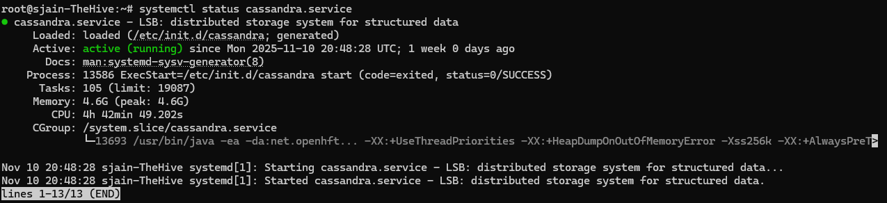<br>
<em>📸 Figure-10: Screenshot of Cassandra service status</em>
</p>

---

#### Step 2: Configure Elasticsearch

##### Verify Elasticsearch Installation

```bash
# Test if Elasticsearch directory exists
nano /etc/elasticsearch/elasticsearch.yml
```

**If "directory does not exist" error appears:**

```bash
# Verify installation
nano /etc/elastic
# Press Tab - if nothing autocompletes, Elasticsearch is not installed
```

---

##### Reinstall Elasticsearch (if needed)

**If Elasticsearch is missing:**

```bash
# Add repository (from Part 2)
wget -qO - https://artifacts.elastic.co/GPG-KEY-elasticsearch | sudo gpg --dearmor -o /usr/share/keyrings/elasticsearch-keyring.gpg
echo "deb [signed-by=/usr/share/keyrings/elasticsearch-keyring.gpg] https://artifacts.elastic.co/packages/7.x/apt stable main" | sudo tee /etc/apt/sources.list.d/elastic-7.x.list

# Update and install
apt update
apt install elasticsearch -y
```

---

##### Edit Elasticsearch Configuration

```bash
nano /etc/elasticsearch/elasticsearch.yml
```

##### Modify Elasticsearch Configuration Settings

##### 1. Cluster Name

```yaml
# Find: #cluster.name: my-application
# Uncomment and change to:
cluster.name: sjain
```

##### 2. Node Name**

```yaml
# Find: #node.name: node-1
# Uncomment (leave as default):
node.name: node-1
```

##### 3. Network Host**

```yaml
# Find: #network.host: 192.168.0.1
# Uncomment and change to TheHive public IP:
network.host: <THEHIVE_PUBLIC_IP>
```

##### 4. HTTP Port**

```yaml
# Find: #http.port: 9200
# Uncomment:
http.port: 9200
```

##### 5. Cluster Initial Master Nodes**

```yaml
# Find: #cluster.initial_master_nodes: ["node-1", "node-2"]
# Uncomment and change to:
cluster.initial_master_nodes: ["node-1"]
```

---

##### Save and Start Elasticsearch

```text
Ctrl + X → Y → Enter
```

```bash
# Start Elasticsearch
systemctl start elasticsearch

# Enable on boot
systemctl enable elasticsearch

# Verify status
systemctl status elasticsearch
```

**Expected output:**

```text
● elasticsearch.service - Elasticsearch
   Active: active (running)
```

<p align="center">
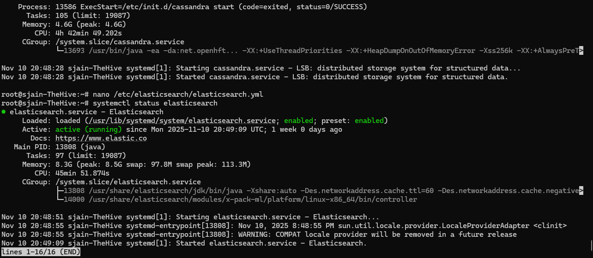<br>
<em>📸 Figure-11: Screenshot of Elasticsearch service status</em>
</p>

---

#### Step 3: Configure TheHive Application

##### Update Directory Permissions

**Important:** TheHive requires ownership of its directory.

```bash
# Change to /opt directory
cd /opt

# View current permissions
ll
```

**Current ownership:** `root:root` for `thp/` directory

**Change ownership:**

```bash
chown -R thehive:thehive /opt/thp
```

**Verify change:**

```bash
ll
# Should show: thehive:thehive for thp/ directory
```

---

##### Edit TheHive Configuration

```bash
nano /etc/thehive/application.conf
```

##### Modify TheHive Configuration Settings

###### 1. Database Hostname (Cassandra)**

```conf
# Find: hostname = ["127.0.0.1"]
# Change to:
hostname = ["<THEHIVE_PUBLIC_IP>"]
```

###### 2. Cluster Name

```conf
# Find: cluster-name = "thp"
# Change to:
cluster-name = "sjain"
```

###### 3. Elasticsearch Hostname

```conf
# Find: hostname = ["127.0.0.1"]
# (Under elasticsearch section)
# Change to:
hostname = ["<THEHIVE_PUBLIC_IP>"]
```

###### 4. Application Base URL

```conf
# Find: baseUrl = "http://localhost:9000"
# Change to:
baseUrl = "http://<THEHIVE_PUBLIC_IP>:9000"
```

---

##### Save and Start TheHive

```text
Ctrl + X → Y → Enter
```

```bash
# Start TheHive
systemctl start thehive

# Enable on boot
systemctl enable thehive

# Verify status
systemctl status thehive
```

<p align="center">
<br>
<em>📸 Figure-12: Screenshot of the TheHive service status</em>
</p>

---

#### Step 4: Verify All Services

```bash
# Check Cassandra
systemctl status cassandra.service

# Check Elasticsearch
systemctl status elasticsearch

# Check TheHive
systemctl status thehive
```

**All services should show:** `Active: active (running)`

---

#### Step 5: Configure Firewall and Access TheHive

##### Allow Port 9000

```bash
# Allow TheHive web interface
ufw allow 9000/tcp
```

---

##### Access TheHive Dashboard

1. Open browser → Navigate to: `http://<THEHIVE_PUBLIC_IP>:9000`
2. **Default credentials:**
   - **Username:** `admin@thehive.local`
   - **Password:** `secret`

3. **Success:** TheHive login page appears

<p align="center">
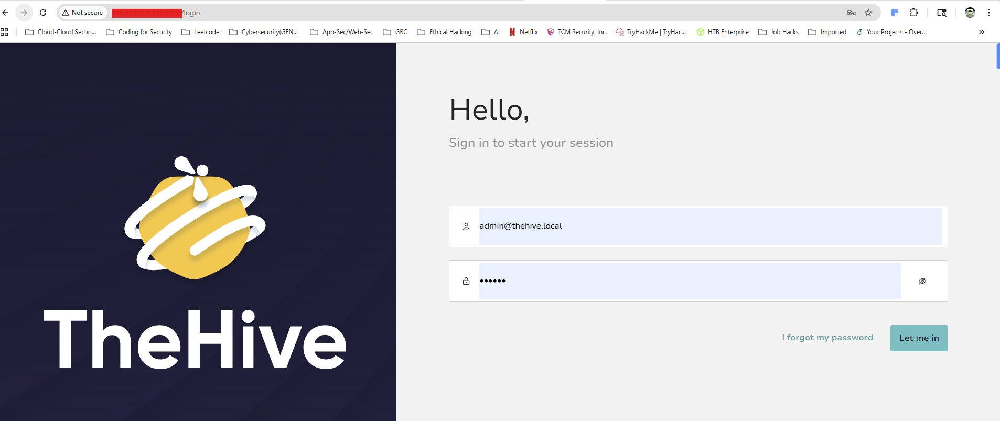<br>
<em>📸 Figure-13: Screenshot of the TheHive Dashboard</em>
</p>

<p align="center">
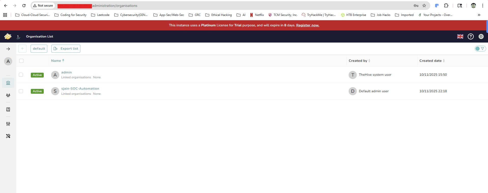<br>
<em>📸 Figure-14: Screenshot of the TheHive Landing page</em>
</p>

---

### 🛡️ Part 2: Wazuh Configuration & Agent Deployment

#### Step 1: Install VirtualBox Guest Additions (Optional)

**Purpose:** Improves VM usability with full-screen support and clipboard sharing.

**In Windows 11 VM:**

1. VirtualBox menu → **Devices** → **Insert Guest Additions CD Image**
2. Open **File Explorer** → Click **CD Drive**
3. Double-click **VBoxWindowsAdditions.exe**
4. Click **Next** → **Next** → **Install**
5. **Reboot** VM when prompted

**After reboot:**

1. **Display:** Right-click Desktop → **Display Settings** → Adjust resolution
2. **Clipboard:** Devices → Shared Clipboard → **Host to Guest**

---

#### Step 2: Access Wazuh Dashboard from Windows VM

**Why access from VM?**

- Simplifies agent installation (download directly on target)
- Avoids manual file transfer

**Steps:**

1. Open **Microsoft Edge** in Windows VM
2. Navigate to: `https://<WAZUH_PUBLIC_IP>`
3. Click **Advanced** → **Proceed**
4. **Login:**
   - Username: `admin`
   - Password: `<saved_from_Part_2>`

---

#### Step 3: Deploy Wazuh Agent

##### Generate Agent Installation Command

**In Wazuh Dashboard:**

1. Left sidebar → Click **Deploy New Agent**
2. **Select OS:** Windows
3. **Server Address:** Enter Wazuh public IP
   - Example: `137.220.53.146`
4. **Agent Name (Optional):** `sjain-Windows`
5. **Copy** installation command

**Example command:**

```powershell
Invoke-WebRequest -Uri https://packages.wazuh.com/4.x/windows/wazuh-agent-4.12.0-1.msi -OutFile ${env:tmp}\wazuh-agent.msi; msiexec.exe /i ${env:tmp}\wazuh-agent.msi /q WAZUH_MANAGER='137.220.53.146' WAZUH_AGENT_NAME='sjain-windows'
net start wazuhsvc
```

---

##### Install Agent on Windows VM

**Open PowerShell as Administrator:**

1. Start Menu → Type `PowerShell`
2. Right-click → **Run as Administrator**
3. **Paste** installation command
4. Press **Enter**
5. Wait for installation to complete

---

##### Start Wazuh Service

```powershell
# Start Wazuh agent service
net start WazuhSvc
```

**Expected output:**

```text
The Wazuh service was started successfully.
```

---

#### Step 4: Configure Wazuh Firewall

**Problem:** Agent cannot communicate with Wazuh server due to firewall.

**Required ports:**

| Port | Protocol | Purpose |
|------|----------|---------|
| 1514 | TCP | Agent event submission |
| 1515 | TCP | Agent enrollment |

---

**SSH into Wazuh server:**

```bash
ssh root@<WAZUH_PUBLIC_IP>
```

**Allow required ports:**

```bash
# Allow agent communication
ufw allow 1514/tcp

# Allow agent enrollment
ufw allow 1515/tcp

# Verify rules
ufw status
```

---

#### Step 5: Restart Agent and Verify Connection

##### Restart Wazuh Service on Windows

###### Method 1: Services GUI

1. Start Menu → Type `services.msc` → Enter
2. Scroll to **Wazuh** service
3. Right-click → **Restart**

###### Method 2: PowerShell

```powershell
Restart-Service WazuhSvc
```

---

##### Verify Agent in Wazuh Dashboard

**From Wazuh Dashboard (host machine or VM):**

1. Navigate to **Home** → **Overview**
2. Refresh page (F5 or click refresh icon)
3. **Expected result:** "1 Active Agent" displayed
4. Click **Agents** (left sidebar) → See agent details:
   - Agent name: `sjain-Windows`
   - Status: Active
   - IP: Windows VM IP
   - Last keep alive: Recent timestamp

<p align="center">
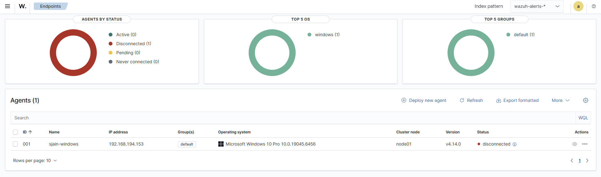<br>
<em>📸 Figure-1: Screenshot of Wazuh Agent</em>
</p>

---

### ✅ Verification Checklist for this part

**TheHive:**

- [ ] Cassandra configured with public IP
- [ ] Elasticsearch configured with public IP
- [ ] TheHive configured with public IP
- [ ] All three services active (running)
- [ ] Port 9000 open in firewall
- [ ] Dashboard accessible at `http://<IP>:9000`
- [ ] Login successful with `admin@thehive.local`

**Wazuh:**

- [ ] Ports 1514 and 1515 open in firewall
- [ ] Agent installed on Windows VM
- [ ] WazuhSvc service running
- [ ] Agent appears in Wazuh dashboard
- [ ] Agent status: Active

---

### 📝 Configuration Summary

#### TheHive Components

| Component | Configuration File | Key Settings |
|-----------|-------------------|--------------|
| **Cassandra** | `/etc/cassandra/cassandra.yaml` | cluster_name, listen_address, rpc_address, seeds |
| **Elasticsearch** | `/etc/elasticsearch/elasticsearch.yml` | cluster.name, network.host, http.port |
| **TheHive** | `/etc/thehive/application.conf` | hostname (Cassandra/ES), baseUrl |

#### Service Commands

```bash
# Check all services
systemctl status cassandra
systemctl status elasticsearch
systemctl status thehive

# Restart if needed
systemctl restart cassandra
systemctl restart elasticsearch
systemctl restart thehive
```

#### Port Summary

| Service | Port | Access |
|---------|------|--------|
| **Wazuh Dashboard** | 443 | HTTPS |
| **Wazuh Agent Communication** | 1514 | TCP |
| **Wazuh Agent Enrollment** | 1515 | TCP |
| **TheHive Web UI** | 9000 | HTTP |

---

## Part 4: Detection Engineering & Custom Rules

### 📋 Overview (Part-4)

In Part 4, we configure Sysmon telemetry ingestion into Wazuh and create custom detection rules for malicious activity. By the end of this part, you will have:

- ✅ Sysmon logs forwarded to Wazuh
- ✅ Archive logging enabled in Wazuh
- ✅ Custom index pattern created
- ✅ Mimikatz detection rule deployed
- ✅ Alert generation verified

---

### 🎯 Objectives (Part-4)

- Configure Wazuh agent to ingest Sysmon logs
- Enable Wazuh archive logging
- Create custom index pattern for raw telemetry
- Generate test telemetry with Mimikatz
- Write custom detection rule
- Verify alert generation

---

### 📊 Part 1: Configure Sysmon Telemetry Ingestion

#### Step 1: Backup Agent Configuration

**On Windows 11 VM:**

1. Open **File Explorer**
2. Navigate to: `C:\Program Files (x86)\ossec-agent\`
3. Locate file: `ossec.conf`
4. **Right-click** → **Copy**
5. **Right-click** in same folder → **Paste**
6. Backup created: `ossec - Copy.conf`

**Purpose:** Allows rollback if configuration breaks.

---

#### Step 2: Edit Wazuh Agent Configuration

##### Open Configuration File as Administrator

1. Start Menu → Type `Notepad`
2. **Right-click** Notepad → **Run as Administrator**
3. **File** → **Open**
4. Navigate to: `C:\Program Files (x86)\ossec-agent\`
5. **File type filter:** Change from "Text Documents" to **All Files**
6. Select `ossec.conf` → **Open**

---

##### Locate Log Analysis Section

**Find the `<localfile>` section:**

```xml
<localfile>
  <location>Application</location>
  <log_format>eventchannel</log_format>
</localfile>

<localfile>
  <location>Security</location>
  <log_format>eventchannel</log_format>
  <query>Event/System[EventID != 5145 and EventID != 5156]</query>
</localfile>
```

---

##### Get Sysmon Event Log Path

**Open Event Viewer:**

1. Start Menu → Type `Event Viewer` → Enter
2. Navigate: **Applications and Services Logs** → **Microsoft** → **Windows** → **Sysmon** → **Operational**
3. **Right-click** Operational → **Properties**
4. **Copy** the **Full Name** field:

```text
Microsoft-Windows-Sysmon/Operational
```

---

##### Configure Sysmon Ingestion

**Replace existing `<localfile>` entries with:**

```xml
<localfile>
  <location>Microsoft-Windows-Sysmon/Operational</location>
  <log_format>eventchannel</log_format>
</localfile>
```

**Example - Remove Application and Security logs (optional):**

```xml
<!-- Before: Multiple log sources -->
<localfile>
  <location>Application</location>
  <log_format>eventchannel</log_format>
</localfile>

<localfile>
  <location>Security</location>
  <log_format>eventchannel</log_format>
  <query>Event/System[EventID != 5145 and EventID != 5156]</query>
</localfile>

<!-- After: Only Sysmon -->
<localfile>
  <location>Microsoft-Windows-Sysmon/Operational</location>
  <log_format>eventchannel</log_format>
</localfile>
```

**Note:** We're focusing only on Sysmon for this lab. In production, you'd typically ingest multiple log sources.

<p align="center">
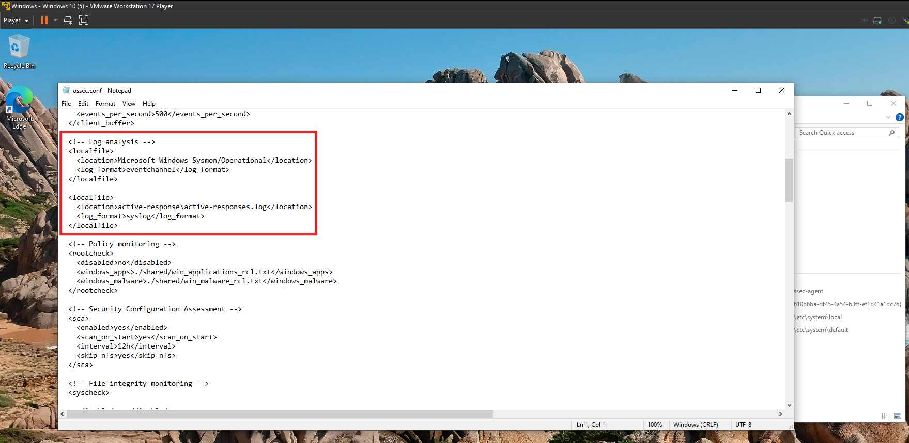<br>
<em>📸 Figure-16: Screenshot of ossec.conf</em>
</p>

---

##### Save the Configuration

1. **File** → **Save**
2. Close Notepad

---

#### Step 3: Restart Wazuh Agent

**Open Services:**

1. Start Menu → Type `services.msc` → Enter
2. Scroll to **Wazuh** service
3. **Right-click** → **Restart**

**Alternative - PowerShell:**

```powershell
Restart-Service WazuhSvc
```

---

#### Step 4: Verify Sysmon Ingestion

**Access Wazuh Dashboard (from host machine):**

1. Navigate to: `https://<WAZUH_PUBLIC_IP>`
2. Login with admin credentials
3. **Left sidebar** → **Explorer** → **Discover**
4. Search for: `Sysmon`
5. **Expand any event** → Scroll down
6. **Verify field:** `data.win.system.channel` contains `Microsoft-Windows-Sysmon/Operational`

**Success indicator:** Sysmon events appear in Wazuh dashboard.

<p align="center">
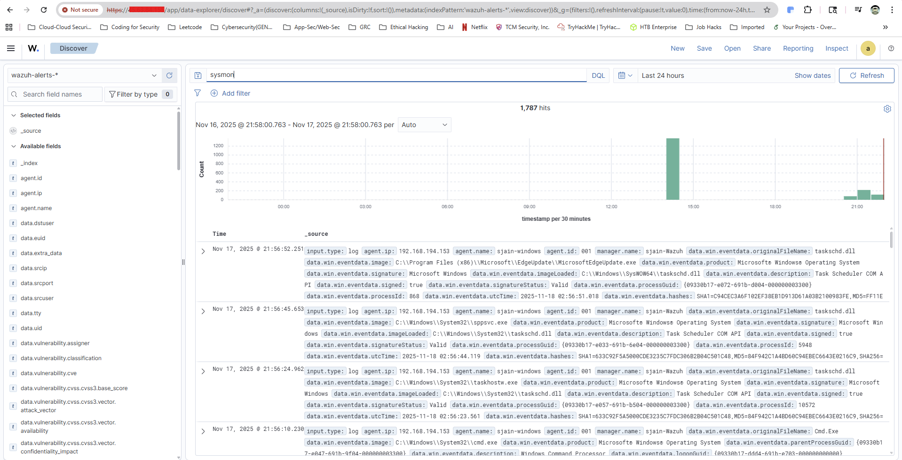<br>
<em>📸 Figure-1: Screenshot of Telemetry visible in Wazuh</em>
</p>

---

### 🦠 Part 2: Generate Test Telemetry with Mimikatz

#### What is Mimikatz?

**Mimikatz** is a post-exploitation tool used to:

- Extract plaintext passwords from memory
- Dump password hashes
- Perform Pass-the-Hash attacks
- Steal Kerberos tickets

**Why use it:** Commonly used by attackers; ideal for testing detection capabilities.

---

#### Step 1: Disable Windows Defender

**Important:** Required to download and execute Mimikatz without interference.

1. Start Menu → Type `Defender` → **Windows Security**
2. Click **Virus & threat protection**
3. **Manage settings** (under Virus & threat protection settings)
4. **Disable the following:**
   - ☐ Real-time protection
   - ☐ Cloud-delivered protection
   - ☐ Automatic sample submission
   - ☐ Tamper protection

---

#### Step 2: Download Mimikatz

1. Open **Microsoft Edge**
2. Search: `Mimikatz GitHub`
3. Navigate to **[gentilkiwi/mimikatz](https://github.com/gentilkiwi/mimikatz)**
4. Click **Code** → Scroll down
5. Click link: **"If you don't want to build it, binaries are available"**
6. Download: `mimikatz_trunk.zip` (version 2.2.0 as of recording)

**If Windows SmartScreen blocks:**

1. Click notification → **Keep**
2. **Show more** → **Keep anyway**

---

#### Step 3: Extract and Execute Mimikatz

**Extract archive:**

1. Navigate to **Downloads** folder
2. **Right-click** `mimikatz_trunk.zip` → **Extract All**
3. Click **Extract**
4. Open folder → Navigate to **x64** subfolder

---

**Execute Mimikatz:**

1. **Shift + Right-click** in x64 folder
2. Select **Open PowerShell window here**
3. Run Mimikatz:

```powershell
.\mimikatz.exe
```

**Expected result:** Mimikatz console opens

**If Windows Defender blocks:** Click **Dismiss** on threat notification

---

#### Step 4: Verify Mimikatz Execution in Wazuh

**Check Wazuh Dashboard:**

1. Navigate to **Discover** tab
2. Search for: `mimikatz`
3. **Current index:** `wazuh-alerts-*`

**Expected result:** **No results found**

**Why?** No detection rule exists yet, so no alerts are generated. Events exist in raw telemetry but not in alerts index.

---

### 🗄️ Part 3: Enable Archive Logging

#### What is Archive Logging?

**Archive logs** store all raw events before rule processing. This allows:

- Analysis of events that didn't trigger alerts
- Historical event review
- Custom rule development
- Compliance requirements

---

#### Step 1: Backup Manager Configuration

**SSH into Wazuh server:**

```bash
ssh root@<WAZUH_PUBLIC_IP>
```

**Create backup:**

```bash
# Backup ossec.conf
cp /var/ossec/etc/ossec.conf /var/ossec/etc/ossec.conf.backup
```

---

#### Step 2: Enable Archive Logging

**Edit configuration:**

```bash
nano /var/ossec/etc/ossec.conf
```

**Find and modify:**

```xml
<!-- Before -->
<global>
  <jsonout_output>yes</jsonout_output>
  <alerts_log>yes</alerts_log>
  <logall>no</logall>
  <logall_json>no</logall_json>
</global>

<!-- After -->
<global>
  <jsonout_output>yes</jsonout_output>
  <alerts_log>yes</alerts_log>
  <logall>yes</logall>
  <logall_json>yes</logall_json>
</global>
```

**Save:**

```text
Ctrl + X → Y → Enter
```

---

#### Step 3: Restart Wazuh Manager

```bash
systemctl restart wazuh-manager.service
```

**Wait ~30 seconds for restart completion.**

---

#### Step 4: Verify Archive Logs

**Navigate to archives directory:**

```bash
cd /var/ossec/logs/archives
```

**List files:**

```bash
ls -lh
```

**Expected output:**

```text
archives.log
archives.json
```

**View logs:**

```bash
cat archives.log
# or
cat archives.json
```

**Success indicator:** Raw event data appears in archive files.

---

#### Step 5: Configure Filebeat for Archives

A lightweight log-shipper installed on the Wazuh Manager server. Moves Wazuh logs to Elasticsearch.

```text
Agents → Wazuh Manager → Filebeat → Elasticsearch → Kibana
```

**Edit Filebeat configuration:**

```bash
nano /etc/filebeat/filebeat.yml
```

**Find and modify archives section:**

```yaml
# Scroll to bottom of file
# Find:
- module: wazuh
  archives:
    enabled: false

# Change to:
- module: wazuh
  archives:
    enabled: true
```

**Save:**

```text
Ctrl + X → Y → Enter
```

---

**Restart Filebeat:**

```bash
systemctl restart filebeat.service
```

**Verify service:**

```bash
systemctl status filebeat.service
```

**Expected:** `Active: active (running)`

<p align="center">
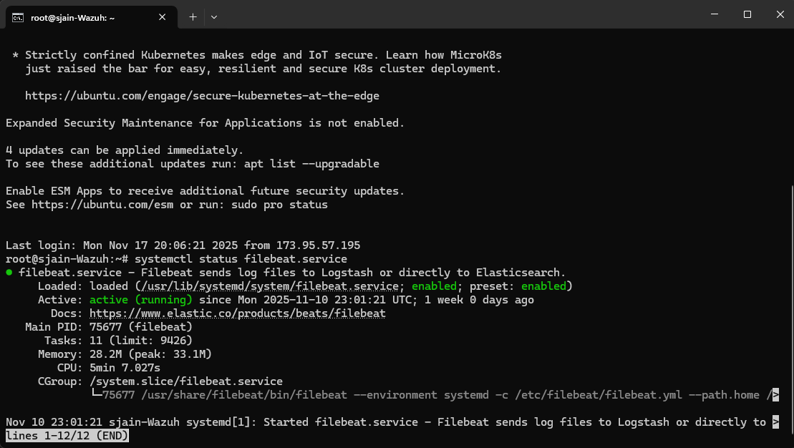<br>
<em>📸 Figure-18: Screenshot of Filebeat service status</em>
</p>

---

### 📑 Part 4: Create Custom Index Pattern

**Elasticsearch = the database system**  
**Index = a collection/table inside Elasticsearch**

Think of it like this:

| Traditional DB | Elasticsearch Equivalent |
|----------------|--------------------------|
| Database       | Elasticsearch             |
| Table          | Index                     |
| Row            | Document                  |
| Column         | Field                     |

So:

- **Elasticsearch holds indexes**
- **Indexes hold documents**
- **Each document is usually a JSON log/alert/event**

#### Step 1: Access Dashboard Management

**In Wazuh Dashboard:**

1. Click **hamburger menu** (☰) top-left
2. Select **Dashboard Management**
3. **Left sidebar** → Click **Index Patterns**

---

#### Step 2: Create Archives Index Pattern

1. Click **Create Index Pattern** (top-right)
2. **Index pattern name:** `wazuh-archives-*`
3. **Expected:** Pattern matches existing indices (shown below search box)
4. Click **Next Step**
5. **Time field:** Select `timestamp` from dropdown
6. Click **Create Index Pattern**

**Success message:** "Index pattern created successfully"

---

#### Step 3: View Archives Data

1. Click **hamburger menu** (☰)
2. Select **Discover**
3. **Index dropdown** (top-left) → Select `wazuh-archives-*`
4. Search for: `mimikatz`

**Expected result:** Mimikatz execution events appear in archives index.

<p align="center">
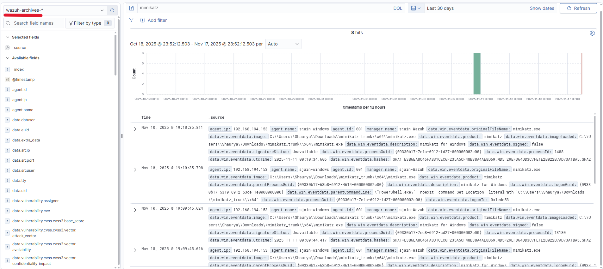<br>
<em>📸 Figure-19: Screenshot of Mimikatz execution in archive index</em>
</p>

---

### 🚨 Part 5: Create Custom Detection Rule

#### Step 1: Re-execute Mimikatz (if needed)

**On Windows VM:**

**If Defender deleted Mimikatz:**

1. Navigate to **Downloads**
2. Re-extract `mimikatz_trunk.zip`
3. **Replace files** when prompted
4. Navigate to **x64** folder

**Execute:**

```powershell
# Open PowerShell in x64 folder (Shift + Right-click)
.\mimikatz.exe
```

**Note:** If still getting deleted, add exclusion (see Step 2).

---

#### Step 2: Add Defender Exclusion (if needed)

**Exclude entire C: drive (for lab purposes only):**

1. **Windows Security** → **Virus & threat protection**
2. **Manage settings** → Scroll to **Exclusions**
3. Click **Add or remove exclusions**
4. **Add an exclusion** → **Folder**
5. Select: `C:\`
6. Click **Select Folder**

**⚠️ WARNING:** Never exclude C:\ in production environments. This is for lab testing only.

---

#### Step 3: Access Rules Management

**In Wazuh Dashboard:**

1. Click **hamburger menu** (☰)
2. Navigate to: **Server Management** → **Rules**
3. **Top-right** → Click **Custom rules** tab
4. Click **Edit** on `local_rules.xml`

---

#### Step 4: Write Mimikatz Detection Rule

**Add the following rule inside `<group>` tags:**

```xml
<group name="sysmon,">
  <rule id="100002" level="15">
    <if_group>sysmon_event1</if_group>
    <field name="win.eventdata.originalFileName" type="pcre2">(?i)mimikatz\.exe</field>
    <description>Mimikatz usage detected</description>
    <mitre>
      <id>T1003</id>
    </mitre>
  </rule>
</group>
```

---

##### Rule Explanation

| Element | Description |
|---------|-------------|
| `id="100002"` | Unique rule ID (100000-120000 reserved for custom rules) |
| `level="15"` | Severity (0-15, where 15 is critical) |
| `<if_group>sysmon_event1</if_group>` | Triggers on Sysmon Event ID 1 (Process Creation) |
| `<field name="win.eventdata.originalFileName">` | Matches original filename metadata |
| `type="pcre2"` | Uses Perl-compatible regex |
| `(?i)mimikatz\.exe` | Case-insensitive match for "mimikatz.exe" |
| `<mitre><id>T1003</id>` | Maps to MITRE ATT&CK technique (Credential Dumping) |

**Why check originalFileName?**
- Attackers often rename mimikatz.exe to evade detection
- Original filename metadata persists even after rename
- Sysmon captures this in Event ID 1

---

#### Step 5: Save and Restart Manager

1. Click **Save** (top-right)
2. Click **Restart Manager**
3. Wait ~30 seconds for restart

**Verify restart:**

```bash
# In SSH session
systemctl status wazuh-manager
```

---

#### Step 6: Test Detection Rule

**On Windows VM:**

```powershell
# Navigate to Mimikatz x64 folder
cd C:\Users\<username>\Downloads\mimikatz_trunk\x64

# List files
ls

# Execute Mimikatz
.\mimikatz.exe
```

**Expected:** Mimikatz launches successfully

---

#### Step 7: Verify Alert Generation

**In Wazuh Dashboard:**

1. Navigate to **Discover**
2. **Switch index** to `wazuh-alerts-*`
3. Search for: `mimikatz`

**Expected result:**

- **1 hit** appears
- **Rule ID:** 100002
- **Rule description:** "Mimikatz usage detected"
- **MITRE ATT&CK:** T1003

**Expand event details:**

```json
{
  "rule": {
    "id": "100002",
    "level": 15,
    "description": "Mimikatz usage detected",
    "mitre": {
      "id": ["T1003"],
      "tactic": ["Credential Access"],
      "technique": ["OS Credential Dumping"]
    }
  },
  "data": {
    "win": {
      "eventdata": {
        "originalFileName": "mimikatz.exe",
        "commandLine": "mimikatz.exe",
        "image": "C:\\Users\\...\\mimikatz.exe"
      }
    }
  }
}
```

<p align="center">
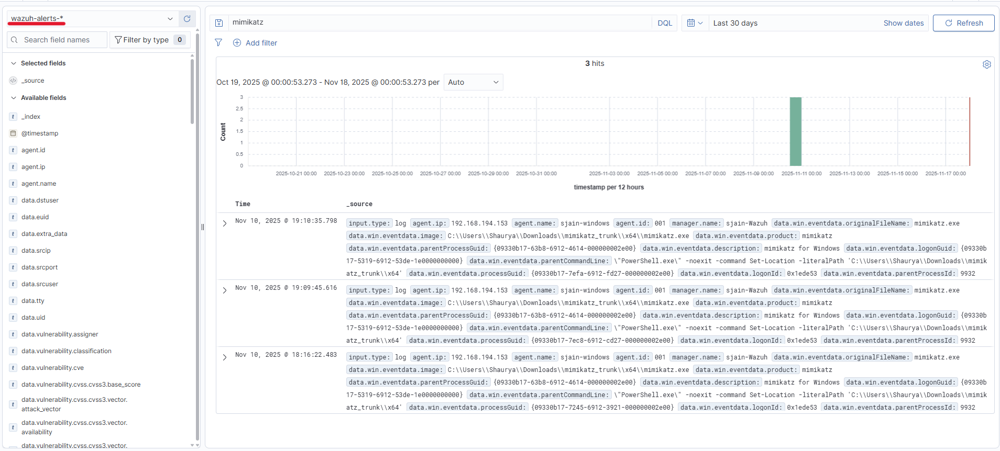<br>
<em>📸 Figure-20: Screenshot of Mimikatz execution in alerts index</em>
</p>

---

### ✅ Checklist to Verify

**Sysmon Configuration:**

- [ ] Wazuh agent configured to ingest Sysmon logs
- [ ] Sysmon events visible in `wazuh-archives-*` index
- [ ] Event field `data.win.system.channel` shows Sysmon

**Archive Logging:**

- [ ] `logall` and `logall_json` enabled in `ossec.conf`
- [ ] Archive files exist: `/var/ossec/logs/archives/`
- [ ] Filebeat configured: `archives: enabled: true`
- [ ] Index pattern created: `wazuh-archives-*`

**Detection Rule:**

- [ ] Custom rule added to `local_rules.xml`
- [ ] Rule ID: 100002
- [ ] Manager restarted successfully
- [ ] Mimikatz execution generates alert
- [ ] Alert appears in `wazuh-alerts-*` index

---

### 📝 Summary (Configuration)

#### Modified Files

| Location | File | Changes |
|----------|------|---------|
| **Windows Agent** | `C:\Program Files (x86)\ossec-agent\ossec.conf` | Added Sysmon log source |
| **Wazuh Manager** | `/var/ossec/etc/ossec.conf` | Enabled archive logging |
| **Filebeat** | `/etc/filebeat/filebeat.yml` | Enabled archives module |
| **Custom Rules** | `/var/ossec/etc/rules/local_rules.xml` | Added Mimikatz detection rule |

#### Service Restart Commands

```bash
# Windows (PowerShell)
Restart-Service WazuhSvc

# Wazuh Manager
systemctl restart wazuh-manager

# Filebeat
systemctl restart filebeat
```

---

## Part 5: SOAR Integration & Automation

### 📋 Overview for this part

In the final part of the SOC Automation Project, we integrate Wazuh with Shuffle (SOAR platform) and TheHive (case management). We'll create automated workflows that detect threats, enrich IOCs, create cases, and notify analysts

By the end of this part, you will have:

- ✅ Shuffle SOAR platform configured
- ✅ Wazuh → Shuffle integration established
- ✅ IOC enrichment with VirusTotal
- ✅ Automated case creation in TheHive
- ✅ Email notifications to analysts

---

### 🎯 Objectives for this part

- Create Shuffle account and workflow
- Configure Wazuh to send alerts to Shuffle
- Parse and enrich file hashes with VirusTotal
- Create automated alerts in TheHive
- Send email notifications

---

### 🔄 Workflow Architecture

```text
Mimikatz Detection (Wazuh)
          ↓
    Shuffle Webhook
          ↓
   Extract SHA256 Hash (Regex)
          ↓
  Enrich with VirusTotal
          ↓
   ┌──────┴──────┐
   ↓             ↓
Create Alert   Send Email
(TheHive)     (Analyst)
```

---

### 🚀 Part 1: Shuffle Setup

#### Step 1: Create Shuffle Account

1. Navigate to **[shuffler.io](https://shuffler.io)**
2. Click **Sign Up**
3. **Create account** (email or OAuth)
4. **Verify email** and login

---

#### Step 2: Create Workflow

**Access Workflows:**

1. Dashboard → Click **Workflows**
2. Click **+ (Plus button)** to create new workflow
3. **Configuration:**
   - **Name:** `SOC Automation 1.0`
   - **Use Case:** Select any (e.g., Detection, Incident Response)
4. Click **Done**

**Result:** Empty workflow canvas with "Change me" placeholder

---

#### Step 3: Add Webhook Trigger

**Add Webhook:**

1. Click **Triggers** tab (center of canvas)
2. **Drag** Webhook trigger to canvas
3. Click webhook to configure (right panel opens)

**Configure Webhook:**

| Setting | Value |
|---------|-------|
| **Name** | `Wazuh_Alerts` |
| **Webhook URI** | Auto-generated - **Copy this URL** |

**Example URI:**

```link
https://shuffler.io/api/v1/hooks/webhook_abc123def456
```

**Important:** Save this webhook URL - needed for Wazuh integration.

---

#### Step 4: Configure Test Response

**Purpose:** Verify webhook receives data before building complex workflow.

1. Click **"Change me"** action on canvas
2. Right panel → **Find Actions** → Select **"Repeat back to me"**
3. **Call field:** Remove "Hello World"
4. Click **+** → Select **Execution Argument**
5. Click **Save** (top-right)

---

### 🔗 Part 2: Wazuh → Shuffle Integration

#### Step 1: Backup Wazuh Configuration

**SSH into Wazuh server:**

```bash
ssh root@<WAZUH_PUBLIC_IP>
```

**Create backup:**

```bash
cp /var/ossec/etc/ossec.conf /var/ossec/etc/ossec.conf.backup
```

---

#### Step 2: Add Integration Configuration

**Edit configuration:**

```bash
nano /var/ossec/etc/ossec.conf
```

**Add integration block** (after `</global>` tag):

```xml
<integration>
  <name>shuffle</name>
  <hook_url>https://shuffler.io/api/v1/hooks/webhook_abc123def456</hook_url>
  <rule_id>100002</rule_id>
  <alert_format>json</alert_format>
</integration>
```

**Configuration explanation:**

| Field | Value | Description |
|-------|-------|-------------|
| `<name>` | `shuffle` | Integration identifier |
| `<hook_url>` | Your webhook URL | Shuffle webhook endpoint |
| `<rule_id>` | `100002` | Only send alerts from this rule (Mimikatz detection) |
| `<alert_format>` | `json` | Send alerts in JSON format |

**Alternative - Send all alerts at severity level:**

```xml
<integration>
  <name>shuffle</name>
  <hook_url>https://shuffler.io/api/v1/hooks/webhook_abc123def456</hook_url>
  <level>5</level>
  <alert_format>json</alert_format>
</integration>
```

<p align="center">
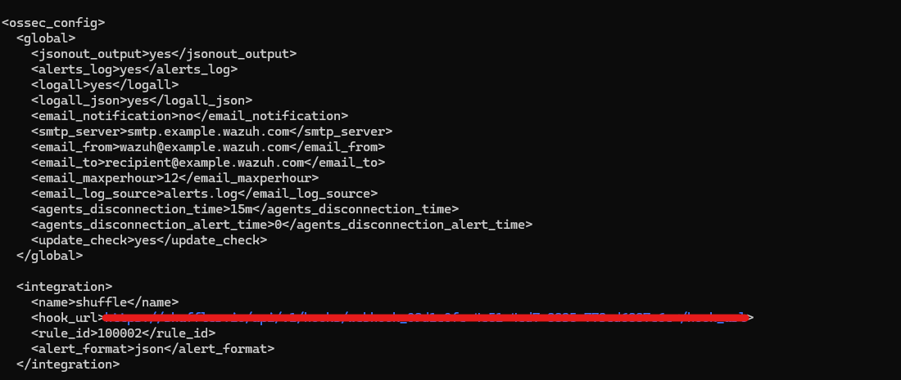<br>
<em>📸 Figure-21: Screenshot of Wazuh-Shuffle Integration</em>
</p>

---

#### Step 3: Verify Configuration Syntax

**Critical checks:**

1. **Webhook URL spacing:** Ensure `hook_url` text is **white**, not purple
   - If purple: URL is incorrectly part of the tag
   - Fix: Add space after `>`

2. **Indentation:** Match existing XML structure (use spaces, not tabs)

3. **Protocol:** Ensure URL starts with `https://` (not `http://`)

**Correct example:**

```xml
<hook_url>https://shuffler.io/api/v1/hooks/webhook_abc123def456</hook_url>
```

**Incorrect examples:**

```xml
<!-- Missing protocol -->
<hook_url>shuffler.io/api/v1/hooks/webhook_abc123def456</hook_url>

<!-- Wrong protocol -->
<hook_url>http://shuffler.io/api/v1/hooks/webhook_abc123def456</hook_url>
```

---

#### Step 4: Save and Restart Wazuh

**Save configuration:**

```text
Ctrl + X → Y → Enter
```

**Restart Wazuh manager:**

```bash
systemctl restart wazuh-manager.service

# Verify service status
systemctl status wazuh-manager.service
```

**Expected output:**

```text
● wazuh-manager.service - Wazuh manager
   Active: active (running)
```

---

#### Step 5: Test Integration

**Generate test alert:**

**On Windows VM:**

```powershell
# Navigate to Mimikatz folder
cd C:\Users\<username>\Downloads\mimikatz_trunk\x64

# Execute Mimikatz
.\mimikatz.exe
```

---

**Verify in Shuffle:**

1. Open Shuffle workflow
2. Click webhook action
3. Click **Start** button (top-right)
4. Click **Executions** tab (bottom panel - person icon)

**Expected result:**

- New execution appears
- **Status:** Success
- Click execution → Expand **Execution Argument**
- See full Wazuh alert JSON data

<p align="center">
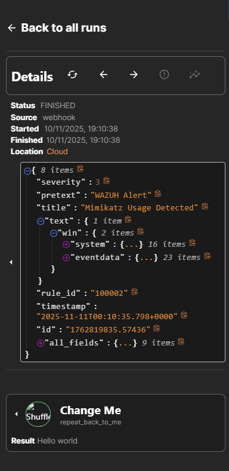<br>
<em>📸 Figure-22: Screenshot of successful integration</em>
</p>

---

### 🔍 Part 3: Extract and Enrich File Hash

#### Step 1: Parse SHA256 Hash with Regex

**Problem:** Wazuh returns hash as `SHA256=abc123def456...`  
**Goal:** Extract only the hash value for VirusTotal lookup

---

**Add Regex Action:**

1. Click **"Change me"** action
2. **Find Actions** → Search: `regex`
3. Select **"Regex capture group"**
4. **Configuration:**
   - **Input Data:** Click **+** → **Execution Argument** → Navigate to hash field
   - Example path: `$.full_log` or `$.data.win.eventdata.hashes`

**Find hash field:**

1. Click webhook → **Executions** → Expand latest execution
2. Search for "SHA256" in JSON
3. Copy field path

---

**Generate Regex with ChatGPT:**

**Prompt:**

```text
Create a regex to parse the SHA256 value from: SHA256=A1B2C3D4E5F6...
```

**ChatGPT response (example):**

```regex
SHA256=([A-Fa-f0-9]{64})
```

**Apply regex in Shuffle:**

1. **Regex field:** Paste regex from ChatGPT
2. Click **Save**
3. Click **Executions** → **Rerun Workflow**
4. Click regex action → Verify output contains only hash

**Success indicator:** Output shows hash without "SHA256=" prefix

<p align="center">
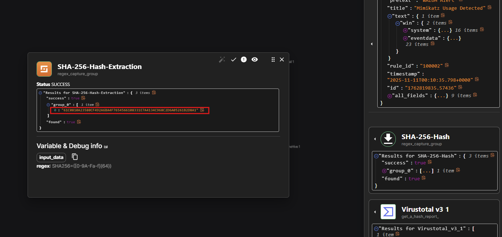<br>
<em>📸 Figure-23: Screenshot of SHA-256 Hash Extracted</em>
</p>


---

#### Step 2: Enrich Hash with VirusTotal

##### Get VirusTotal API Key

1. Navigate to **[virustotal.com](https://www.virustotal.com)**
2. **Sign Up** or **Login**
3. Go to **Profile** → **API Key**
4. **Copy** API key

---

##### Add VirusTotal to Workflow

**Activate VirusTotal app:**

1. Click **Apps** tab (bottom-left)
2. Search: `virustotal`
3. Click **VirusTotal** tile to activate
4. Wait ~30 seconds for activation

---

**Add to workflow:**

1. **Drag** VirusTotal app to canvas
2. **Connect** regex action → VirusTotal
3. Click VirusTotal action

**Configure VirusTotal:**

| Setting | Value |
|---------|-------|
| **Name** | `Virustotal_v3_1` |
| **Find Actions** | Select **"Get a hash report"** |
| **Authenticate** | Click **+** → Paste API key → Submit |
| **ID/Hash** | Click **+** → Select regex output → Choose `list` |

**Important:** Select **regex output** as the hash source, not execution argument.

---

##### Test VirusTotal Integration

1. Click **Save**
2. Click **Executions** → **Rerun Workflow**
3. Click VirusTotal action → Expand **Body**

**Expected output:**

```json
{
  "data": {
    "attributes": {
      "last_analysis_stats": {
        "malicious": 63,
        "suspicious": 0,
        "undetected": 8,
        "harmless": 0
      }
    }
  }
}
```

**Success indicator:** `malicious` count > 0

<p align="center">
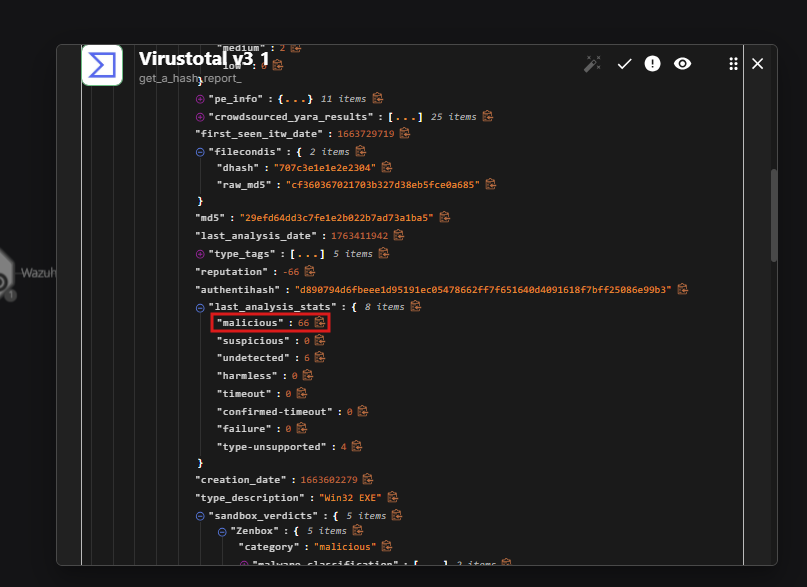<br>
<em>📸 Figure-24: Screenshot of Hash Lookup results from VirusTotal</em>
</p>

---

### 🗂️ Part 4: TheHive Integration

#### Step 1: Create TheHive Organization and Users

**Access TheHive:**

1. Navigate to: `http://<THEHIVE_PUBLIC_IP>:9000`
2. **Login:** `admin@thehive.local` / `secret`

---

**Create Organization:**

1. Click **+ (plus)** icon (top-left)
2. **Organization Name:** `sjain-SOC-Automation`
3. **Description:** `SOC Automation Project`
4. Click **Confirm**

---

**Create Analyst User:**

1. Click into **MyDFIR** organization
2. Click **Add User** (prompted automatically)
3. **Configuration:**
   - **Type:** Normal
   - **Login:** `sjain@test.com`
   - **Name:** `Shaurya`
   - **Profile:** Analyst
4. Click **Save**

**Set password:**

1. Click user → **Preview**
2. Scroll to **Set a new password**
3. Enter password → **Confirm**

---

**Create Service Account (for Shuffle):**

1. Click **Add User** again
2. **Configuration:**
   - **Type:** Service
   - **Login:** `shuffle@test.com`
   - **Name:** `SOAR`
   - **Profile:** Analyst (in production, use custom restricted role)
3. Click **Confirm**

**Create API Key:**

1. Click service account → **Preview**
2. Click **Create API Key**
3. **Copy** API key → Save securely

<p align="center">
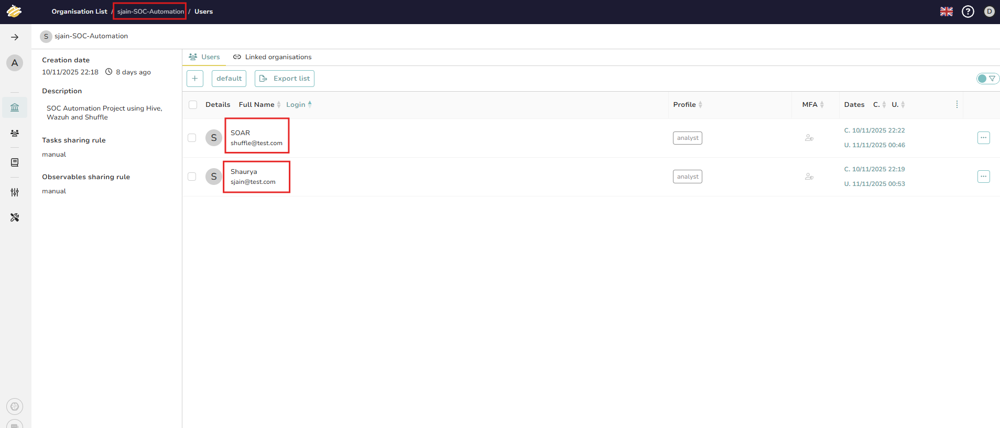<br>
<em>📸 Figure-25: Screenshot of TheHive Organization and Users</em>
</p>

---

#### Step 2: Configure TheHive in Shuffle

**Add TheHive app:**

1. Click **Apps** → Search: `thehive`
2. Select **TheHive 5** → Activate
3. **Drag** to workflow canvas
4. **Connect:** VirusTotal → TheHive

---

**Authenticate:**

1. Click TheHive action
2. Click **+ (Authenticate)**
3. **Configuration:**
   - **API Key:** Paste service account API key
   - **URL:** `http://<THEHIVE_PUBLIC_IP>:9000`
4. Click **Submit**

---

**Configure Alert Creation:**

| Field | Value | Source |
|-------|-------|--------|
| **Find Actions** | `Create alert` | - |
| **Date** | Click **+** → Execution Argument → `timestamp` | Wazuh alert timestamp |
| **Description** | `Mimikatz detected on host {computer} from user {user}` | Dynamic fields from alert |
| **Flag** | `false` | Not flagged by default |
| **Pap** | `2` | Permissible Actions Protocol (TLP equivalent) |
| **Severity** | `3` | 1=Low, 2=Medium, 3=High, 4=Critical |
| **Source** | `Wazuh` | Alert source identifier |
| **Source Ref** | `100002` | Rule ID |
| **Status** | `New` | Initial case status |
| **Summary** | `Mimikatz detected on {computer}, PID: {process_id}, CommandLine: {command_line}` | Detailed summary |
| **Tags** | `["T1003"]` | MITRE ATT&CK technique (array format) |
| **Title** | Click **+** → Execution Argument → `rule.description` | Dynamic title from rule |
| **Tlp** | `2` | Traffic Light Protocol (Amber) |
| **Type** | `Internal` | Alert origin |

---

**Dynamic field mapping example:**

```text
Description: Mimikatz detected on host <<execution_argument.data.win.system.computer>> from user <<execution_argument.data.win.eventdata.user>>
```

**Shuffle auto-completes field paths when you select from execution argument.**

---

#### Step 3: Test TheHive Integration

**Temporarily allow Shuffle → TheHive traffic:**

**Configure cloud firewall:**

1. Cloud provider dashboard → **Networking** → **Firewalls**
2. **Add Rule:**
   - **Protocol:** TCP
   - **Port:** 9000
   - **Source:** All IPv4 (`0.0.0.0/0`)
3. **Attach to TheHive server**

**⚠️ WARNING:** This rule is for testing only. Remove after lab completion.

---

**Test workflow:**

1. Click **Save** in Shuffle
2. Click **Executions** → **Rerun Workflow**
3. Expand **TheHive** action → Verify `Status: 200 OK`

**Verify in TheHive:**

1. Navigate to TheHive dashboard
2. Click **Alerts** (left sidebar)
3. **Expected:** New alert appears
   - **Title:** Mimikatz usage detected
   - **Description:** Contains host and user details
   - **Summary:** Includes process ID and command line
   - **Tags:** T1003

**Success indicator:** Alert created with all dynamic fields populated correctly

<p align="center">
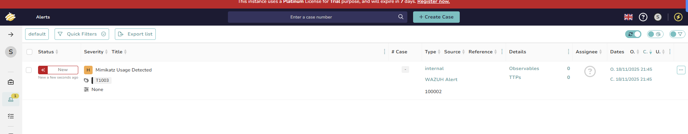<br>
<em>📸 Figure-26: Screenshot of Alert generated in TheHive</em>
</p>

<p align="center">
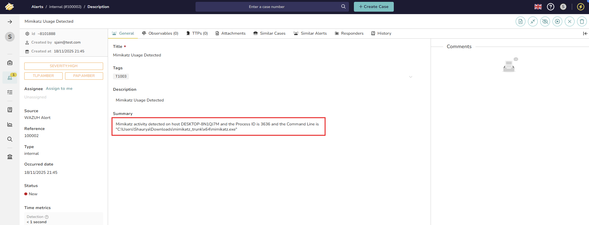<br>
<em>📸 Figure-27: Screenshot of Screenshot of Alert generated in TheHive (Detailed)</em>
</p>

---

### 📧 Part 5: Email Notifications

#### Step 1: Get Disposable Email (Optional)

**Using SquareX (Recommended):**

1. Navigate to **[sqrx.com](https://sqrx.com)** (or similar disposable email service)
2. **Generate** disposable email address
3. Keep tab open to receive emails

**Alternative:** Use personal email (not recommended for labs)

---

#### Step 2: Add Email Action

**Configure email notification:**

1. Click **Apps** → Search: `email`
2. **Drag** Email app to canvas
3. **Connect:** VirusTotal → Email

**Configure Email:**

| Field | Value |
|-------|-------|
| **Recipient** | Your disposable email address |
| **Subject** | `Mimikatz Detected!` |
| **Body** | See template below |

---

**Email body template:**

```text
⚠️ SECURITY ALERT ⚠️

Time: <<execution_argument.timestamp>>
Title: <<execution_argument.rule.description>>
Host: <<execution_argument.data.win.system.computer>>
User: <<execution_argument.data.win.eventdata.user>>
Process ID: <<execution_argument.data.win.eventdata.processId>>
Command Line: <<execution_argument.data.win.eventdata.commandLine>>
SHA256: <<regex_output>>
VirusTotal Detections: <<virustotal.body.data.attributes.last_analysis_stats.malicious>>/71

Please investigate immediately.
```

**Use Shuffle's field picker (+ button) to ensure correct paths.**

---

#### Step 3: Test Email Notification

1. Click **Save**
2. Click **Executions** → **Rerun Workflow**
3. Check disposable email inbox

**Expected email:**

```text
Subject: Mimikatz Detected!

⚠️ SECURITY ALERT ⚠️

Time: 2024-01-15T10:30:45Z
Title: Mimikatz usage detected
Host: MyDFIR-PC
User: Administrator
Process ID: 4829
Command Line: mimikatz.exe
SHA256: a1b2c3d4e5f6...
VirusTotal Detections: 63/71

Please investigate immediately.
```

<p align="center">
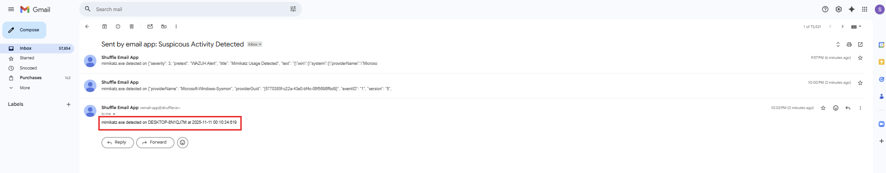<br>
<em>📸 Figure-28: Screenshot of Email Alert Generated</em>
</p>

---

## 🔁 Final Playbook Flow

<p align="center">
<br>
<em>📸 Figure-29: Screenshot of Final Shuffle Workflow</em>
</p>

---

## ⚠️ Troubleshooting Log (issues encountered & resolutions)

### 1. SSH connection refused to cloud server

**Cause:** Firewall blocking port 22 OR IP changed

**Fix:**

- Allow port 22 in firewall
- Update allowed IP's for SSH
- Re-check Vultr instance is running

### 2. Java not installed (java: command not found)

**Fix:**

```bash
apt update
apt install java-11-amazon-corretto-jdk -y
java -version
```

### 3. Wazuh Dashboard inaccessible

**Cause:** Required port not allowed

**Fix:**

```bash
ufw allow 443/tcp
ufw allow 9000/tcp
```

### 4. Wazuh Dashboard login failed (Invalid username/password)

**Cause:** Admin password unknown or overwritten

**Fix:**

- Export OpenSearch security config
- Edit `internal_users.yml`
- Re-upload using `securityadmin.sh`

### 5. Missing security configuration files (internal_users.yml, roles.yml, etc.)

**Cause:** Path differences in newer Wazuh version

**Fix:**

- Export configs manually:

```bash
securityadmin.sh -r -cd /usr/share/wazuh-indexer/opensearch-security/exported/
```

### 6. Filebeat unauthorized (401 Unauthorized)

**Cause:** Wrong Filebeat → Indexer credentials

**Fix:**

Set correct credentials:

```yaml
output.elasticsearch:
  username: admin
  password: <your-new-password>
```

Restart:

```bash
systemctl restart filebeat
```

### 7. Archives index missing (`wazuh-archives-*` not found)

**Cause:** Filebeat not authorized → archives not ingested

**Fix:**

- Enable archives in Filebeat & ossec.conf
- Fix credentials
- Restart services
- Verify with:

```bash
curl localhost:9200/_cat/indices?v
```

### 8. Wazuh Agent not appearing in dashboard

**Causes:**

- Wrong `<address>` in ossec.conf
- Ports 1514/1515 blocked

**Fix:**

- Update agent config
- Allow required ports
- Restart Wazuh agent

```powershell
Restart-Service WazuhSvc
```

### 9. Agent connection timeout ("Never connected")

**Fix:**

- Check server log:

```bash
tail -f /var/ossec/logs/ossec.log
```

- Check Windows agent log
- Verify firewall rules

### 10. No Sysmon events in Wazuh

**Cause:** Sysmon not declared in ossec.conf

**Fix:**

Add:

```xml
<localfile>
  <location>Microsoft-Windows-Sysmon/Operational</location>
  <log_format>eventchannel</log_format>
</localfile>
```

Restart agent.

### 11. Custom rule not firing (e.g., Mimikatz rule)

**Causes:**

- Wrong rule syntax
- XML error
- Wrong field name

**Fix:**

- Validate XML:

```bash
xmllint --noout /var/ossec/etc/rules/local_rules.xml
```

- Test using:

```bash
/var/ossec/bin/wazuh-logtest
```

### 12. Windows Defender deleting mimikatz.exe

**Fix:**

Add exclusion: Windows Security → Virus & Threat Protection → Exclusions → Add Folder

### 13. Wrong index selected in Dashboard

**Fix:**

Use correct index:

- Alerts → `wazuh-alerts-*`
- All events → `wazuh-archives-*`

### 14. Wazuh → Shuffle webhook not receiving data

**Fix:**

- Ensure valid webhook URL
- Rule ID matches
- Check logs:

```bash
tail -f /var/ossec/logs/ossec.log | grep -i integration
```

### 15. VirusTotal action returns 404

**Cause:** Deprecated API endpoint

**Fix:**

- Fork VirusTotal app inside Shuffle
- Change endpoint from: `/api/v3/files/report` → `/api/v3/files/{id}`

### 16. TheHive alert not created

**Fix:**

- Validate API key
- Ensure port 9000 open
- Check Shuffle execution logs for errors

---

## 🧠 Key Learnings

### 1. **SIEM Architecture and Deployment**

Gained hands-on experience deploying and configuring Wazuh SIEM in a cloud environment, including agent management, log collection architecture, and distributed system design.  
*Practical Application:* Deployed multi-server infrastructure with proper network segmentation, firewall configuration, and service hardening for production-grade security monitoring.

### 2. **Detection Engineering and Rule Development**

Developed custom detection rules using XML-based syntax to identify malicious activity (Mimikatz execution) by analyzing Sysmon telemetry and mapping to MITRE ATT&CK framework (T1003 - Credential Dumping).  
*Practical Application:* Authored detection logic that identifies renamed malicious executables using OriginalFileName metadata, demonstrating evasion-resistant detection techniques.

### 3. **SOAR Platform Implementation**

Designed and implemented automated security workflows in Shuffle SOAR platform, integrating webhook triggers, regex parsing, and multi-step orchestration for alert enrichment and case management.  
*Practical Application:* Built end-to-end automation pipelines that reduced manual SOC analyst workload through automated IOC enrichment, case creation, and notification workflows.

### 4. **Security Tool Integration**

Established interoperability across Wazuh, Shuffle, TheHive, and VirusTotal through API authentication, webhook configuration, and JSON data mapping.  
*Practical Application:* Configured cross-platform integrations using REST APIs, ensuring secure data exchange between SIEM, SOAR, and case management systems.

### 5. **Incident Response Automation**

Created automated incident response playbooks that detect threats, enrich artifacts, create structured cases in TheHive, and notify analysts via email—reducing mean time to respond (MTTR).  
*Practical Application:* Designed workflows following IR best practices: Detection → Enrichment → Case Creation → Notification, ensuring consistent response procedures.

### 6. **Threat Intelligence Enrichment**

Implemented automated IOC (Indicator of Compromise) enrichment using VirusTotal API to provide malware analysis context (detection ratios, threat classification) directly in security workflows.  
*Practical Application:* Integrated threat intelligence feeds into detection workflows, enabling analysts to make informed decisions with malware reputation data.

### 7. **Technical Troubleshooting and Problem-Solving**

Diagnosed and resolved complex technical issues including service configuration errors, authentication failures (401 Unauthorized), firewall misconfigurations, and API integration problems.  
*Practical Application:* Demonstrated systematic troubleshooting methodology: log analysis, configuration validation, service restart procedures, and root cause identification.

### 8. **Case Management System Configuration**

Deployed and configured TheHive case management platform with Apache Cassandra and Elasticsearch backend, including user management, API authentication, and alert workflow integration.  
*Practical Application:* Built collaborative incident tracking infrastructure that enables structured investigations, evidence management, and analyst coordination.

---

## 🔗 References & Resources

- [YouTube Series Part 1](https://www.youtube.com/watch?v=XR3eamn8ydQ&list=PLG6KGSNK4PuBWmX9NykU0wnWamjxdKhDJ&index=7) – Creating a Logical Diagram.
- [YouTube Series Part 2](https://www.youtube.com/watch?v=YxpUx0czgx4&list=PLG6KGSNK4PuBWmX9NykU0wnWamjxdKhDJ&index=8) – Setting up the SOC automation lab infrastructure by installing a Windows 10 client with Sysmon, a Wazuh server, and a TheHive server (mostly in the cloud), along with VirtualBox and required dependencies.
- [YouTube Series Part 3](https://www.youtube.com/watch?v=VuSKMPRXN1M&list=PLG6KGSNK4PuBWmX9NykU0wnWamjxdKhDJ&index=9) – Configuration of TheHive and Wazuh servers—tuning Cassandra and Elasticsearch, fixing access issues, starting services, and registering a Windows 10 client so it reports events into Wazuh successfully.
- [YouTube Series Part 4](https://www.youtube.com/watch?v=amTtlN3uvFU&list=PLG6KGSNK4PuBWmX9NykU0wnWamjxdKhDJ&index=10) - Sysmon logs are forwarded to Wazuh, Mimikatz telemetry is generated, archive ingestion is enabled, and a custom rule is created to detect Mimikatz—even when renamed—using the OriginalFileName field.
- [YouTube Series Part 5](https://www.youtube.com/watch?v=f18isDfMIlY&list=PLG6KGSNK4PuBWmX9NykU0wnWamjxdKhDJ&index=68&pp=iAQB) - sending Wazuh Mimikatz alerts to Shuffle via webhook, extracting the SHA-256 hash for VirusTotal enrichment, creating a corresponding alert in TheHive via API, and automatically emailing the SOC analyst when Mimikatz activity is detected.

---
